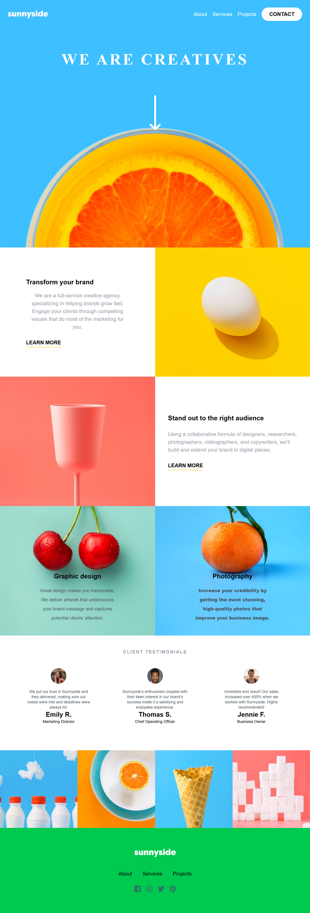

# Frontend Mentor - Sunnyside agency landing page

---  
## Overview  
This is my solution to the  Frontend Mentor  challenge for Sunnyside Agency Landing Page. It was a challenge to different layout for device screen sizes & hover states.  
---  
## Screenshot  
Below is a preview  of my completed solution.

 

## Links 

- **GitHub Repository:** [View Code](https://github.com/siddik-rahman/sunnyside-agency-landing-page-main)

- **Live Site:** [View Live](https://siddik-rahman.github.io//sunnyside-agency-landing-page-main/) 
 
## Built with 

- Semantic HTML5 markup
- Tailwind CSS
- Flexbox
- Grid
- Mobile-first workflow 
- Responsive Web Design
--- 
## What I learned 
- How to use Tailwind CSS
- How to use Flexbox
- How to use Grid 
- How to use Media Query  
--- 

## AI Collaboration 
I used AI as a learning assistant for:
- Debugging 
- Brainstorming ideas 
- Understanding Tailwind CSS concepts 

## Author 

- **Siddik Rahman**
- GitHub: [@siddik-rahman](https://github.com/siddik-rahman)

## Acknowledgments 
Thanks to **Frontend Mentor** for providing this excellent challenge to improve my frontend development skills.